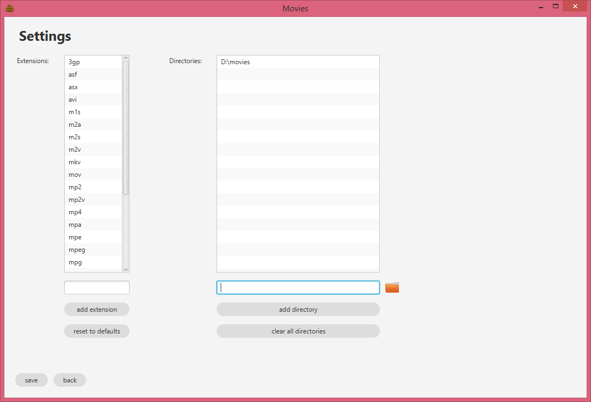
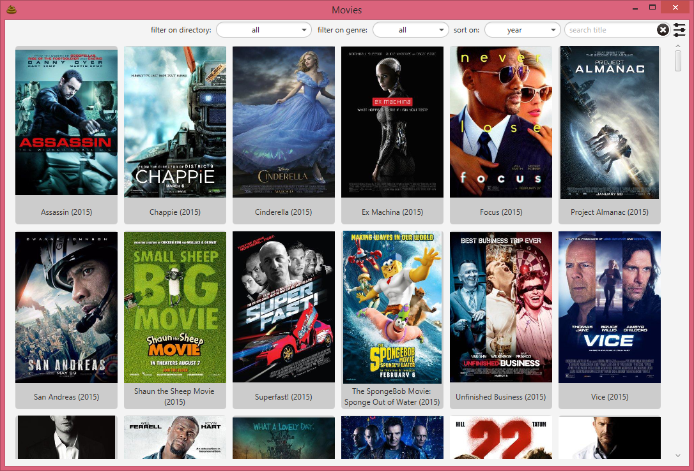
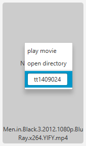
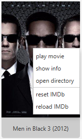
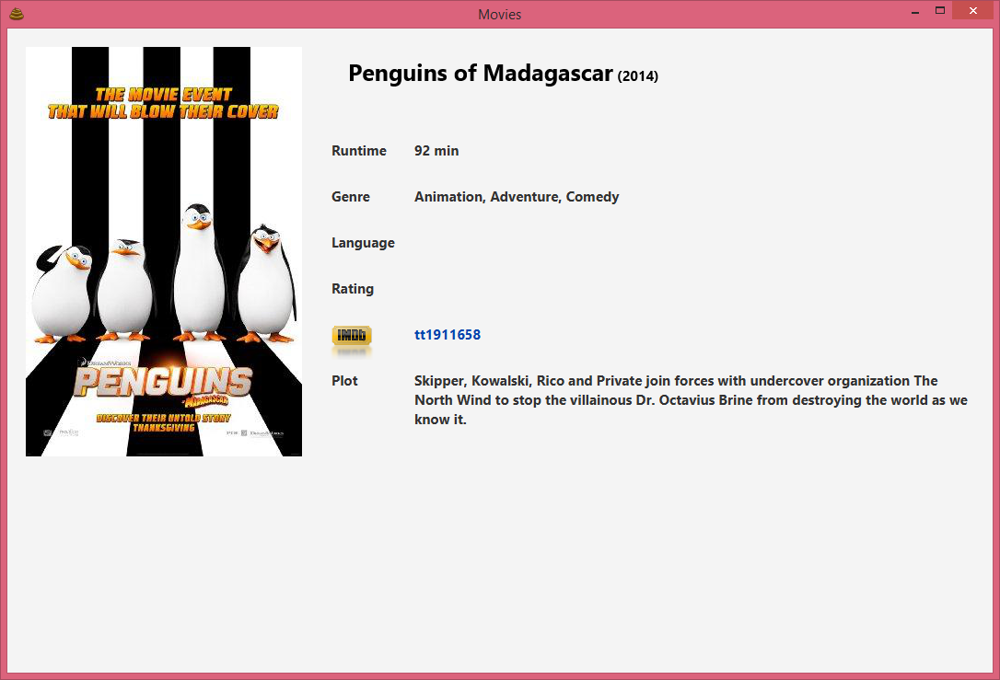
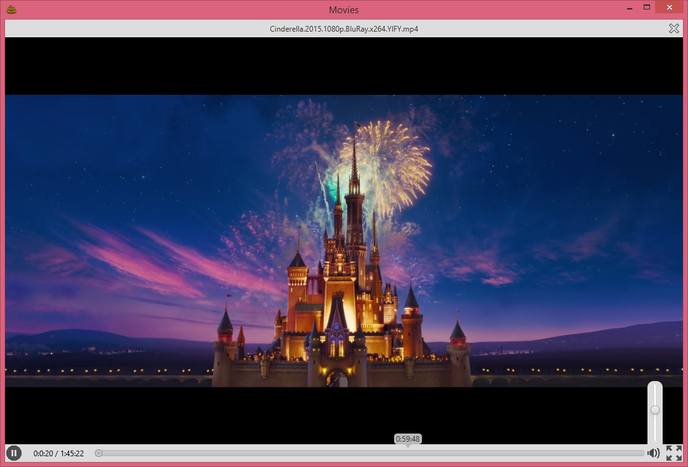

# MovieApp

Cross-platform [javafx 8](http://docs.oracle.com/javase/8/javafx/get-started-tutorial/jfx-overview.htm#BABEDDGH) application for managing and watching movies from your filesystem.

Movies will be streamed to vlc using my VLCPlayer ([github page](https://github.com/kkriske/VLCPlayer)) which uses [vlcj](http://capricasoftware.co.uk/#/projects/vlcj) ([github page](https://github.com/caprica/vlcj)) so you will require an up-to-date version of vlc.

All information is fetched using [OMDb API](http://www.omdbapi.com/), the IMDb ID has to be set for each file individually.

This is still a work in progress.

### screenshots

#### settings

the specified directories are assumed to have the following layout:

* specified directory (D:/movies in the example above)
  * movie directory
    * movie file
    * optional srt files
  * movie direcotry
    * movie file
    * optional srt files
  * etc

#### main window

###### specifying IMDb ID
 

#### info overview

#### movie playback

